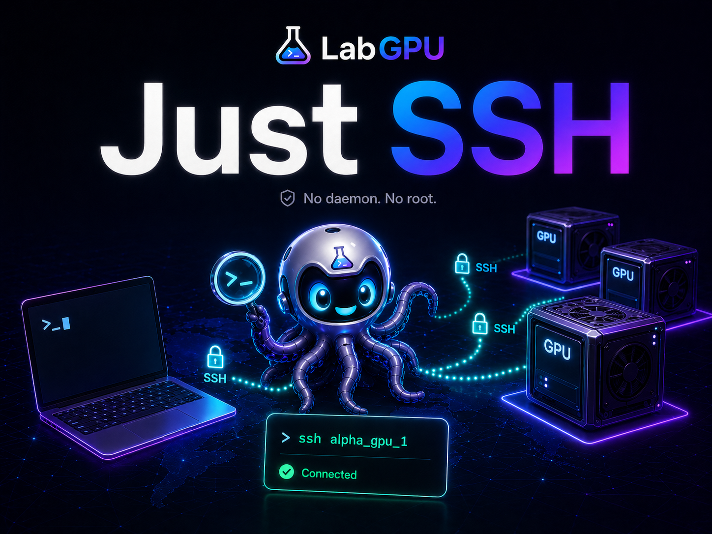
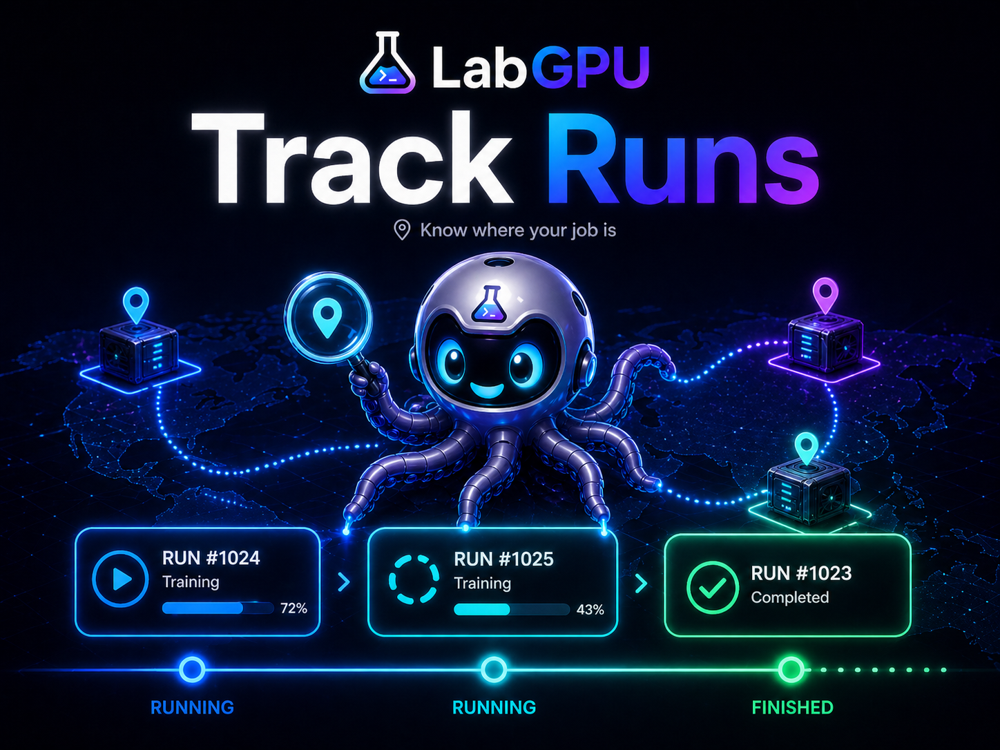

# LabGPU

[](https://github.com/66LIU-frank/Labgpu-controller/actions/workflows/ci.yml)


[English](README.md) | [简体中文](README.zh-CN.md)

Personal GPU workspace for students using shared SSH servers.

Find a free GPU. Launch training. Track your runs. Diagnose failures.
No daemon. No root. No Slurm. No Kubernetes.

<table>
  <tr>
    <td></td>
    <td></td>
  </tr>
</table>

<p align="center">
  
</p>

```text
find GPU -> run/adopt -> observe -> diagnose -> context/report -> safe action
```

## Get Started in 3 Minutes

You run LabGPU on your own laptop. It reads your `~/.ssh/config`, probes the SSH hosts you choose, and opens a local web workspace. You do not need root access, a remote daemon, Slurm, Kubernetes, or a shared tracking server.

Most users follow this path:

```text
install -> labgpu ui -> Settings add/import servers -> Train Now copy command -> labgpu where
```

Before using real servers, make sure this works:

- Python 3.10+
- `ssh YOUR_ALIAS` can reach your GPU server, or you know the host/user/key needed to add one
- NVIDIA servers should have `nvidia-smi`

### 1. Install

```bash
pipx install git+https://github.com/66LIU-frank/Labgpu-controller.git
```

No `pipx`? Use:

```bash
curl -fsSL https://raw.githubusercontent.com/66LIU-frank/Labgpu-controller/main/install.sh | sh
```

### 2. Try the demo

```bash
labgpu demo
labgpu pick --fake-lab
```

### 3. Add your SSH GPU servers

If your aliases already exist in `~/.ssh/config`:

```bash
labgpu init --hosts alpha_liu,alpha_shi --tags A100,training
```

Or start the UI and add/import servers from `Settings`:

```bash
labgpu ui
```

In `Settings` you can:

- choose which servers appear on the homepage
- add a new SSH server and optionally write a `Host` block to `~/.ssh/config`
- import existing SSH aliases
- create optional server groups such as `AlphaLab`, `off-campus`, or `H800`

LabGPU does not create SSH keys for you. It uses your normal SSH setup: password login, SSH key, ssh-agent, `IdentityFile`, or `ProxyJump` all stay in SSH config. For automatic background probes, key/agent login is the smoothest because it avoids interactive password prompts.

### 4. Find a GPU and copy the launch command

Use the `Train Now` page, or run:

```bash
labgpu pick --min-vram 24G --prefer A100 --explain
labgpu pick --min-vram 24G --prefer 4090 --cmd "python train.py --config configs/sft.yaml"
```

Each recommended GPU card can copy:

- `ssh HOST`
- `CUDA_VISIBLE_DEVICES=GPU_INDEX`
- a launch snippet
- or open an SSH terminal for that server

### 5. Track your own training

On the GPU server, run through LabGPU when you want a full run capsule:

```bash
labgpu run --name sft --gpu auto --min-vram 24G -- python train.py --config configs/sft.yaml
labgpu where
```

If a training job is already running, adopt it:

```bash
labgpu adopt 23891 --name old_baseline --log ./train.log
```

## What It Does

| Need | LabGPU gives you |
| --- | --- |
| Find a usable GPU | `Train Now` and `labgpu pick` rank GPUs across SSH hosts. |
| Start training quickly | Copy SSH, `CUDA_VISIBLE_DEVICES`, launch snippets, or open an SSH terminal from the GPU card. |
| Find your own jobs | `My Runs` and `labgpu where` show tracked, adopted, and own GPU processes. |
| Organize servers | Save enabled servers in Settings, then create optional empty or populated groups in Groups. |
| Manage config without editing files | Add/import SSH hosts, write safe SSH config blocks, and update `~/.labgpu/config.toml` from the UI. |
| Move a project | `labgpu sync` streams a project from one SSH server to another through your laptop. |
| Check transfer speed | `labgpu nettest` measures effective copy speed before you move a project. |
| Recover experiment context | Run capsules save command, log, git, config, env summary, and GPU info. |
| Debug failures | `diagnose` and Failure Inbox catch OOM, traceback, NCCL, disk full, killed, NaN, and suspected idle. |
| Ask AI or teammates for help | `labgpu context --copy` exports one redacted Markdown debug context. |
| Stop safely | UI actions only target your own process, with conservative checks. |

## Common Tasks

Find a GPU:

```bash
labgpu pick --min-vram 24G --prefer A100 --tag training --explain
labgpu pick --min-vram 24G --prefer 4090 --cmd "python train.py --config configs/sft.yaml"
```

Launch or adopt training on a GPU server:

```bash
labgpu run --name baseline --gpu auto --min-vram 24G -- python train.py
labgpu adopt 23891 --name old_baseline --log ./train.log
```

Find and debug your work:

```bash
labgpu where
labgpu logs baseline --tail 100
labgpu diagnose baseline
labgpu context baseline --copy
labgpu report baseline
```

Move a project to another GPU server:

```bash
labgpu nettest alpha_liu alpha_shi --mb 64
labgpu sync alpha_liu:/data/me/project alpha_shi:/data/me/project
labgpu sync alpha_liu:/data/me/project alpha_shi:/data/me/project --execute --yes
```

`sync` streams through your laptop by default, so it does not require the two servers to SSH into each other. Add `--direct` to `nettest` only when the source server can SSH into the target server.

## UI Layout

LabGPU Home is training-first:

```text
Train Now
  Recommended GPUs ranked by GPU availability, free VRAM, model, load, and tags.
  Each card can copy commands or open an SSH terminal for that server.

My Runs
  LabGPU runs, adopted runs, and own untracked GPU processes.

Failed or Suspicious Runs
  OOM, traceback, NCCL, disk full, killed, NaN, suspected idle, and stale logs.

Problems
  Offline/cached servers, disk warnings, probe timeouts, and process health warnings.

Servers
  Resource details stay below the main workflow.

Settings
  Add/import SSH hosts, choose the homepage server set, and toggle JSON/API links.

Groups
  Create empty groups, assign saved servers later, delete group names without deleting servers.
```

Server groups are optional. You can create an empty group such as `liusuu`, add servers later, or delete a group name without deleting the saved servers. Group chips appear on Home, Train Now, My Runs, Servers, Alerts, and Assistant, so you can switch between all servers and a specific pool like `AlphaLab`.

The UI supports Chinese/English and light/dark mode. Pages load from local snapshots first, then refresh stale SSH data in the background, so moving between pages does not wait on slow SSH probes. The top-right cache label shows how old the current cached data is.

## Run Capsule

Each tracked or adopted run gets a directory under `~/.labgpu/runs/`:

```text
meta.json
events.jsonl
stdout.log
command.sh
env.json
git.json
config/
git.patch
diagnosis.json
```

This records the useful debugging surface: command, cwd, user, host, GPU, PID, logs, git commit/patch, selected configs, Python/Conda/venv summary, exit code, diagnosis, and Markdown context.

## Modes

Agentless SSH Mode is the default. LabGPU runs on your laptop, reads `~/.ssh/config`, and probes servers over SSH. No remote install is needed for GPU/process visibility.

Enhanced Mode is optional. If the remote server has `labgpu` on `PATH`, LabGPU Home also reads:

```bash
labgpu status --json
labgpu list --json
```

That enables richer tracked/adopted run details. If it fails, the UI falls back to Agentless Mode.

## Safety

LabGPU is personal-first. It is not a scheduler, reservation system, quota system, admin panel, Slurm/Kubernetes replacement, or a tool for managing other people's jobs.

Safe stop actions:

- only show for processes owned by the current SSH user
- are disabled for shared Linux accounts unless configured otherwise
- re-probe PID/user/start time/command hash before acting
- send SIGTERM by default
- require explicit force for SIGKILL
- are disabled outside loopback unless `--allow-actions` is set

Commands and debug context are redacted by default. Shared `LABGPU_HOME` is advanced because it can expose metadata to other users; see [docs/security.md](docs/security.md) and [docs/lab_setup.md](docs/lab_setup.md).

## Commands

```text
labgpu init [--hosts alpha_liu,alpha_shi] [--tags A100,training]
labgpu ui [--hosts alpha_liu,alpha_shi] [--fake-lab]
labgpu pick [--min-vram 24G] [--prefer A100] [--tag training] [--explain] [--cmd "COMMAND"] [--json]
labgpu where [--json]
labgpu nettest SRC_HOST DST_HOST [--mb 64] [--both] [--direct] [--json]
labgpu sync SRC_HOST:/project DST_HOST:/project [--execute] [--exclude PATTERN]

labgpu run --name NAME --gpu 0|auto [--min-vram 24G] -- COMMAND ...
labgpu adopt PID --name NAME [--log train.log]
labgpu list [--all] [--json]
labgpu logs RUN [--tail 100] [--follow]
labgpu diagnose RUN
labgpu context RUN [--copy] [--format markdown|json]
labgpu report RUN [--json]
labgpu kill RUN [--force]

labgpu status [--json] [--fake] [--watch]
labgpu servers list
labgpu servers probe alpha_liu
labgpu demo
```

## LabGPU Assistant

Experimental and unfinished. The Assistant is not the main product promise yet; it is a preview of where LabGPU can go after the core GPU/run/debug workflow is solid.

What works today:

- Local mode: no external API, rule-based answers from the current LabGPU workspace.
- BYO API mode: enter your own OpenAI-compatible chat-completions URL, model, and API key in the Assistant page.
- Read-only answers for GPU recommendations, visible failures, run locations, and copyable launch/debug-context commands.

What is not finished:

- no reliable multi-turn planning yet
- no full tool-call framework
- no automatic launch/adopt/stop execution
- no mobile/PWA push notification workflow yet
- failure explanations are still basic and depend on visible LabGPU context

API mode sends a redacted workspace summary to your configured endpoint. It stays read-only and copy-only. It does not execute arbitrary SSH shell commands.

TODO:

- improve failure explanations from logs, configs, git state, env summary, and GPU history
- add a structured LabGPU tool-call layer instead of free-form shell execution
- add explicit confirmation cards for future approved LabGPU actions
- add mobile/PWA notifications for failed runs, suspected idle runs, and newly free GPUs

## Status

LabGPU is alpha. It currently targets NVIDIA servers via `nvidia-smi`, SSH aliases, tmux-based local run launch, run capsules, GPU ranking, Failure Inbox, debug context export, and safe own-process actions.

Known boundaries:

- no scheduler, queue, reservation, quota, or admin panel
- no full authentication layer for public-facing web use
- shared Linux accounts should disable stop actions or use Enhanced Mode
- MIG, Docker, MPS, Slurm, and ROCm details are documented in [docs/compatibility.md](docs/compatibility.md)

Useful docs:

- [Quickstart](docs/quickstart.md)
- [Security](docs/security.md)
- [Compatibility](docs/compatibility.md)
- [Lab setup](docs/lab_setup.md)
- [Changelog](CHANGELOG.md)
