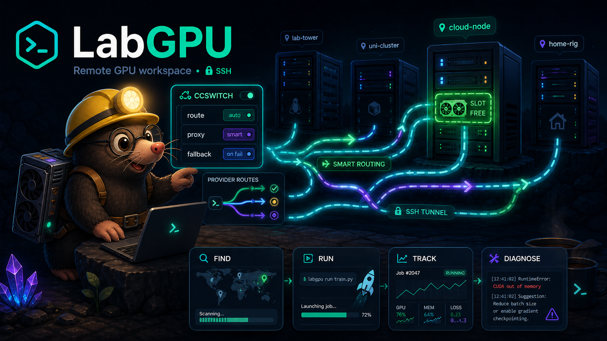
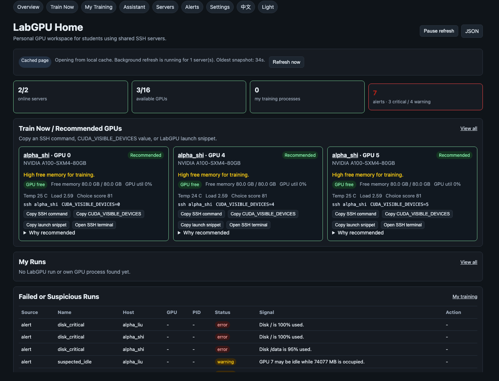
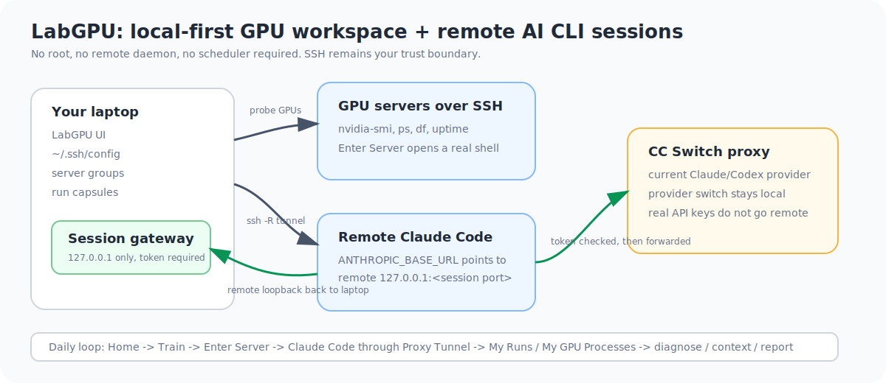

# LabGPU

[](https://github.com/66LIU-frank/Labgpu-controller/actions/workflows/ci.yml)


[English](README.md) | [简体中文](README.zh-CN.md)

LabGPU 是给学生和研究者个人使用的本地优先 GPU 工作台。它面向共享 SSH GPU
服务器：帮你找可用 GPU、进入正确服务器和目录、追踪自己的训练、诊断失败，并让远程
Claude Code 走本机 CC Switch provider，而不是把 API key 写到服务器上。

不需要 root，不需要远程 daemon，不要求 Slurm/Kubernetes，也不需要共享 tracking
server。

<p align="center">
  
</p>

<p align="center">
  
</p>

```text
找 GPU -> 进入服务器 -> 启动/接管 -> 观察 -> 诊断 -> 导出 context/report
```

## 为什么用 LabGPU

很多实验室 GPU 用户已经有 SSH 账号，但缺一个清晰的个人工作台。LabGPU 保留这个模式：

- 跑在你的电脑上
- 读取你正常的 `~/.ssh/config`
- 通过 SSH 探测服务器
- 不在共享机器上安装 daemon
- 对危险操作保持保守，只管理自己的进程
- 默认让 AI provider secret 留在本机

## 主界面

UI 现在收束成五个主入口：

| 页面 | 用途 |
| --- | --- |
| Home | 总览、推荐 GPU、当前任务、问题、保存的服务器。 |
| Train | 找 GPU、打开终端、查看 `My Runs` 和 `My GPU Processes`。 |
| Servers | 查看 SSH 服务器、磁盘、GPU、健康状态和分组入口。 |
| AI Sessions | 查看/切换已有 CC Switch provider，启动远程 Claude Code session。 |
| Settings | 新增/导入 SSH 服务器，选择保存的服务器，管理分组。 |

次级功能仍然保留：

- `Groups` 可以从 Home、Servers、Settings 进入。
- `Problems` 可以从 Home、Servers 进入。
- `Assistant` 可以从 Home 进入。
- JSON/API 链接默认隐藏，可在 Settings 里打开。

## AI Sessions

LabGPU 可以让远程 Claude Code 使用你本机的 CC Switch provider，同时不把真实 API key
写到远程服务器。

当前支持的链路：

```text
Enter Server
  -> Claude Code
  -> Proxy Tunnel
  -> 本机 LabGPU session gateway
  -> 本机 CC Switch proxy
  -> 当前 provider
```

现在已经支持：

- 读取非 secret 的 CC Switch provider 状态
- 在 LabGPU 中通过更新本机 current-provider 状态切换已有 CC Switch provider
- 打开远程 shell 并进入指定 working directory
- 创建 SSH reverse tunnel 和 per-session gateway
- 在远程 `/tmp` 下创建临时 Claude Code wrapper/settings
- 在远程 shell 里运行只读的 `aiswitch status` / `aiswitch doctor`
- 真实 provider key 留在本机或 CC Switch

现在刻意不做：

- 在 LabGPU 里新增带 API key 的 provider
- 写 provider key 到远程 `~/.claude`、`~/.codex`、`~/.gemini`
- 多用户 provider vault
- Codex/Gemini 远程 session launcher

新增 provider 先在 CC Switch 里做。LabGPU 刷新后会读到它，并可以在已有 provider
之间切换。切换只更新 CC Switch 本机 current-provider 状态；LabGPU 不创建或保存
provider key。

## 快速开始

安装：

```bash
pipx install git+https://github.com/66LIU-frank/Labgpu-controller.git
```

没有 `pipx`：

```bash
curl -fsSL https://raw.githubusercontent.com/66LIU-frank/Labgpu-controller/main/install.sh | sh
```

打开本地 UI：

```bash
labgpu ui
```

固定服务器范围：

```bash
labgpu ui --hosts alpha_liu,alpha_shi
```

使用真实服务器前，先确认：

- 本机有 Python 3.10+
- `ssh YOUR_ALIAS` 能连上 GPU 服务器，或者你知道 host/user/key
- NVIDIA GPU 服务器上有 `nvidia-smi`

## 添加服务器

如果 alias 已经在 `~/.ssh/config`：

```bash
labgpu init --hosts alpha_liu,alpha_shi --tags A100,training
```

也可以在 UI 的 Settings 中：

- 新增 SSH 服务器
- 导入已有 SSH alias
- 可选地追加安全的 `Host` block 到 `~/.ssh/config`
- 选择默认显示哪些服务器
- 创建 `AlphaLab`、`off-campus`、`H800` 这类分组

LabGPU 不创建 SSH key。密码登录、SSH key、ssh-agent、`IdentityFile`、`ProxyJump`
都继续交给正常 SSH config。

## 找 GPU 并进入服务器

用 Train 页面，或者命令行：

```bash
labgpu pick --min-vram 24G --prefer A100 --explain
labgpu pick --min-vram 24G --prefer 4090 --cmd "python train.py --config configs/sft.yaml"
```

每张 GPU 卡片可以复制：

- `ssh HOST`
- `CUDA_VISIBLE_DEVICES=GPU_INDEX`
- 启动片段
- Enter Server 终端入口

Enter Server 还可以自动填 VS Code Remote-SSH 最近目录，并让远程 Claude Code 通过本机
provider tunnel 工作。

## 追踪训练

启动 tracked run：

```bash
labgpu run --name sft --gpu auto --min-vram 24G -- python train.py --config configs/sft.yaml
```

接管已经在跑的进程：

```bash
labgpu adopt 23891 --name old_baseline --log ./train.log
```

之后找回自己的任务：

```bash
labgpu where
labgpu list
labgpu logs sft --tail 100
```

每个 tracked/adopted run 都会在 `~/.labgpu/runs/` 下保存 plain-file capsule：

```text
meta.json
events.jsonl
stdout.log
command.sh
env.json
git.json
config/
git.patch
diagnosis.json
```

## 诊断和导出上下文

```bash
labgpu diagnose sft
labgpu context sft --copy
labgpu report sft
```

LabGPU 会检查 OOM、traceback、NCCL、disk full、killed、NaN、stale logs、疑似 idle
GPU memory、zombie/IO-wait 等信号。

`labgpu context --copy` 会生成默认脱敏的 Markdown context，方便发给 AI 或同学。

## 搬项目

```bash
labgpu nettest alpha_liu alpha_shi --mb 64
labgpu sync alpha_liu:/data/me/project alpha_shi:/data/me/project
labgpu sync alpha_liu:/data/me/project alpha_shi:/data/me/project --execute --yes
```

默认通过你的电脑中转，所以两台服务器不需要互相 SSH。

## 模式

**Agentless SSH Mode** 是默认模式。LabGPU 本地运行，用 `nvidia-smi`、`ps`、`df`、
`free`、`uptime` 这类远程命令探测服务器。

**Enhanced Mode** 是可选模式。如果远程 PATH 里有 `labgpu`，UI 还会读取：

```bash
labgpu status --json
labgpu list --json
```

Enhanced Mode 失败不会影响 Agentless Mode。

## 架构

LabGPU 把控制面留在本机。SSH 仍然是服务器边界；AI session 会先通过
session-scoped 本机 gateway，再转发到本机 provider proxy。

<p align="center">
  
</p>

## 安全边界

LabGPU 是 personal-first。它不是 scheduler、reservation system、quota system、
admin panel、Slurm/Kubernetes replacement，也不是管理别人任务的工具。

安全停止进程：

- 只对当前 SSH 用户自己的进程显示
- shared Linux account 默认不开放 stop action
- 操作前重新校验 PID/user/start time/command hash
- 默认发 SIGTERM
- 强制 SIGKILL 需要单独确认
- 非 loopback 绑定默认禁用 mutating actions

AI session 安全：

- LabGPU 只读 provider name、current selection、proxy port
- 真实 provider key 保持在 CC Switch 或本机 provider 工具里
- 远程服务器只拿到临时 `labgpu-session-*` token
- 本机 gateway 校验 token 后才转发
- Alpha 阶段 Remote Write 保持禁用

完整安全说明见 [docs/security.md](docs/security.md)。

## 命令速查

```text
labgpu init [--hosts alpha_liu,alpha_shi] [--tags A100,training]
labgpu ui [--hosts alpha_liu,alpha_shi] [--fake-lab]
labgpu pick [--min-vram 24G] [--prefer A100] [--tag training] [--explain] [--cmd "COMMAND"] [--json]
labgpu where [--json]
labgpu nettest SRC_HOST DST_HOST [--mb 64] [--both] [--direct] [--json]
labgpu sync SRC_HOST:/project DST_HOST:/project [--execute] [--exclude PATTERN]

labgpu run --name NAME --gpu 0|auto [--min-vram 24G] -- COMMAND ...
labgpu adopt PID --name NAME [--log train.log]
labgpu list [--all] [--json]
labgpu logs RUN [--tail 100] [--follow]
labgpu diagnose RUN
labgpu context RUN [--copy] [--format markdown|json]
labgpu report RUN [--json]
labgpu kill RUN [--force]

labgpu status [--json] [--fake] [--watch]
labgpu servers list
labgpu servers probe alpha_liu
labgpu demo
```

## 文档

- [Quickstart](docs/quickstart.md)
- [AI Session Smoke Test](docs/ai-session-smoke-test.md)
- [Security](docs/security.md)
- [Compatibility](docs/compatibility.md)
- [Lab setup](docs/lab_setup.md)
- [Design](docs/design.md)
- [Roadmap and Feature Status](docs/roadmap.md)

## 状态

LabGPU 仍是 alpha。当前重点是 NVIDIA + SSH + `nvidia-smi`、本地 run capsule、GPU
ranking、session-scoped AI proxy tunnel、Failure Inbox、脱敏 context export、传输工具
和安全的 own-process actions。
