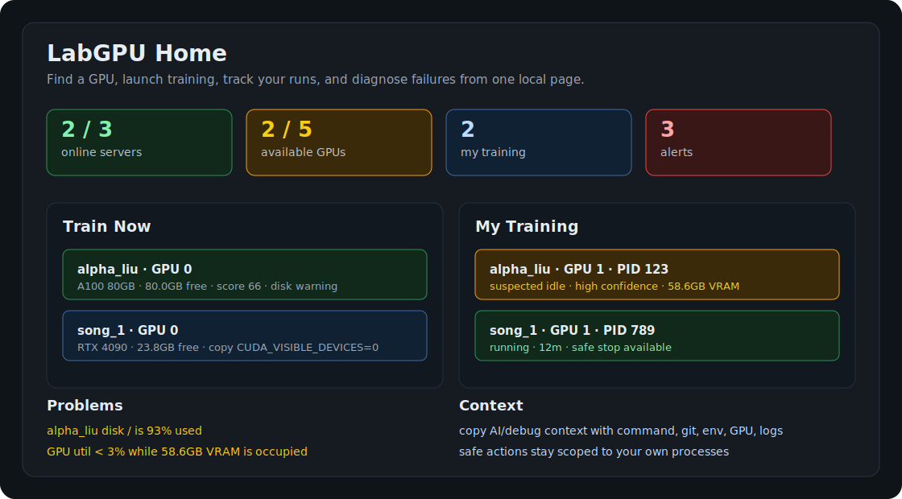

# LabGPU

[](https://github.com/66LIU-frank/Labgpu-controller/actions/workflows/ci.yml)


[English](README.md) | [简体中文](README.zh-CN.md)

给学生个人用的远程 GPU 训练工作台。

在多台共享 SSH GPU 服务器里找空卡、启动训练、找回自己的任务、诊断失败。
不需要 daemon，不需要 root，不需要 Slurm，不需要 Kubernetes。



```text
找卡 -> 启动/接管 -> 观察 -> 诊断 -> 导出 context/report -> 安全处理
```

## 快速开始

没有 GPU 的电脑也可以先看假数据 demo：

```bash
pipx install git+https://github.com/66LIU-frank/Labgpu-controller.git
labgpu demo
labgpu pick --fake-lab
```

使用你自己的 SSH GPU 服务器：

```bash
labgpu init --hosts alpha_liu,alpha_shi --tags A100,training
labgpu ui
labgpu pick --min-vram 24G --prefer A100
```

在选中的 GPU 服务器上启动训练：

```bash
labgpu run --name sft --gpu auto --min-vram 24G -- python train.py --config configs/sft.yaml
labgpu where
```

## 它能帮你做什么

| 需求 | LabGPU 做什么 |
| --- | --- |
| 找一张现在能用的 GPU | `Train Now` 和 `labgpu pick` 跨 SSH hosts 排名推荐。 |
| 快速开跑 | 复制 SSH 命令、`CUDA_VISIBLE_DEVICES`、启动片段，或从 GPU 卡片直接打开 SSH 终端。 |
| 找回自己的任务 | `My Runs` 和 `labgpu where` 显示 tracked、adopted、自己的 GPU process。 |
| 保存实验现场 | run capsule 保存命令、日志、git、config、env summary、GPU 信息。 |
| 诊断失败 | `diagnose` 和 Failure Inbox 识别 OOM、Traceback、NCCL、disk full、killed、NaN、suspected idle。 |
| 发给 AI/同学求助 | `labgpu context --copy` 复制一份默认脱敏的 Markdown debug context。 |
| 和工作台对话 | `LabGPU Assistant` 基于当前 GPU/runs/failure 数据回答，并返回可复制计划。 |
| 安全停止 | UI 只对自己的进程显示 stop action，并做保守校验。 |

## 日常用法

安装：

```bash
pipx install git+https://github.com/66LIU-frank/Labgpu-controller.git
```

或者：

```bash
curl -fsSL https://raw.githubusercontent.com/66LIU-frank/Labgpu-controller/main/install.sh | sh
```

选择首页要展示哪些 SSH 服务器：

```bash
labgpu init
labgpu init --hosts alpha_liu,alpha_shi --tags A100,training
```

打开个人训练工作台：

```bash
labgpu ui
```

找 GPU：

```bash
labgpu pick --min-vram 24G --prefer A100 --tag training --explain
labgpu pick --min-vram 24G --prefer 4090 --cmd "python train.py --config configs/sft.yaml"
```

在 GPU 服务器上启动或接管训练：

```bash
labgpu run --name baseline --gpu auto --min-vram 24G -- python train.py
labgpu adopt 23891 --name old_baseline --log ./train.log
```

找回、看日志、诊断、导出 context：

```bash
labgpu where
labgpu logs baseline --tail 100
labgpu diagnose baseline
labgpu context baseline --copy
labgpu report baseline
```

## UI 首页

LabGPU Home 不是以 server card 为主，而是按训练流程排：

```text
Train Now
  按 GPU 是否空闲、显存、型号、负载和 tags 推荐 GPU。
  每张卡都可以复制命令，或打开对应服务器的 SSH 终端。

My Runs
  我的 LabGPU runs、adopted runs、自己的 untracked GPU processes。

Failed or Suspicious Runs
  OOM、Traceback、NCCL、disk full、killed、NaN、suspected idle、日志不更新。

Assistant
  只读聊天入口，用来推荐 GPU、回答任务在哪、总结失败项、生成可复制启动/debug 计划。

Problems
  离线/缓存服务器、磁盘告警、probe timeout、process health warning。

Servers
  服务器资源详情放在下面，不作为主入口。
```

UI 支持中文/英文、深色/浅色模式。页面会先用本地快照打开，再后台刷新 SSH 数据，所以切换页面时不用每次都等 SSH probe。

## Run Capsule

每个 tracked/adopted run 都会在 `~/.labgpu/runs/` 下保存实验现场：

```text
meta.json
events.jsonl
stdout.log
command.sh
env.json
git.json
config/
git.patch
diagnosis.json
```

这些文件记录：命令、cwd、用户、host、GPU、PID、日志、git commit/patch、配置文件、Python/Conda/venv 摘要、退出码、诊断结果和 Markdown context。

## 两种模式

Agentless SSH Mode 是默认模式。LabGPU 在你的电脑上运行，读取 `~/.ssh/config`，通过 SSH 探测远端服务器。不需要在远端安装 LabGPU，也能看 GPU/process/server health。

Enhanced Mode 是可选增强。如果远端服务器的 `PATH` 里有 `labgpu`，LabGPU Home 会额外读取：

```bash
labgpu status --json
labgpu list --json
```

这样能显示更完整的 tracked/adopted run 信息。失败时会自动回退到 Agentless Mode。

## 安全边界

LabGPU 是个人工具，不是 scheduler、reservation、quota、admin panel，也不是 Slurm/Kubernetes/W&B/MLflow 的替代品。

安全停止默认很保守：

- 只对当前 SSH 用户自己的进程显示
- shared Linux account 默认禁用 stop action
- 操作前重新 probe PID/user/start time/command hash
- 默认发 SIGTERM
- SIGKILL 需要显式 force
- UI 绑定到非 loopback 时默认禁用修改操作

命令和 debug context 默认脱敏。共享 `LABGPU_HOME` 属于高级用法，可能暴露日志、命令、配置和诊断信息；看 [docs/security.md](docs/security.md) 和 [docs/lab_setup.md](docs/lab_setup.md) 再用。

## 常用命令

```text
labgpu init [--hosts alpha_liu,alpha_shi] [--tags A100,training]
labgpu ui [--hosts alpha_liu,alpha_shi] [--fake-lab]
# 浏览器里打开 /assistant 可使用 LabGPU Assistant。
labgpu pick [--min-vram 24G] [--prefer A100] [--tag training] [--explain] [--cmd "COMMAND"] [--json]
labgpu where [--json]

labgpu run --name NAME --gpu 0|auto [--min-vram 24G] -- COMMAND ...
labgpu adopt PID --name NAME [--log train.log]
labgpu list [--all] [--json]
labgpu logs RUN [--tail 100] [--follow]
labgpu diagnose RUN
labgpu context RUN [--copy] [--format markdown|json]
labgpu report RUN [--json]
labgpu kill RUN [--force]

labgpu status [--json] [--fake] [--watch]
labgpu servers list
labgpu servers probe alpha_liu
labgpu demo
```

## 当前状态

LabGPU 还在 alpha。当前主要支持 NVIDIA `nvidia-smi`、SSH aliases、tmux 启动、本地 run capsule、GPU 推荐、Failure Inbox、debug context 导出和只停止自己进程的安全操作。

已知边界：

- 不做 scheduler、queue、reservation、quota、admin panel
- Web UI alpha 阶段没有完整认证层，请默认本地使用
- shared Linux account 建议禁用 stop action，或者用 Enhanced Mode
- MIG、Docker、MPS、Slurm、ROCm 兼容性见 [docs/compatibility.md](docs/compatibility.md)

更多文档：

- [Quickstart](docs/quickstart.md)
- [Security](docs/security.md)
- [Compatibility](docs/compatibility.md)
- [Lab setup](docs/lab_setup.md)
- [Changelog](CHANGELOG.md)
